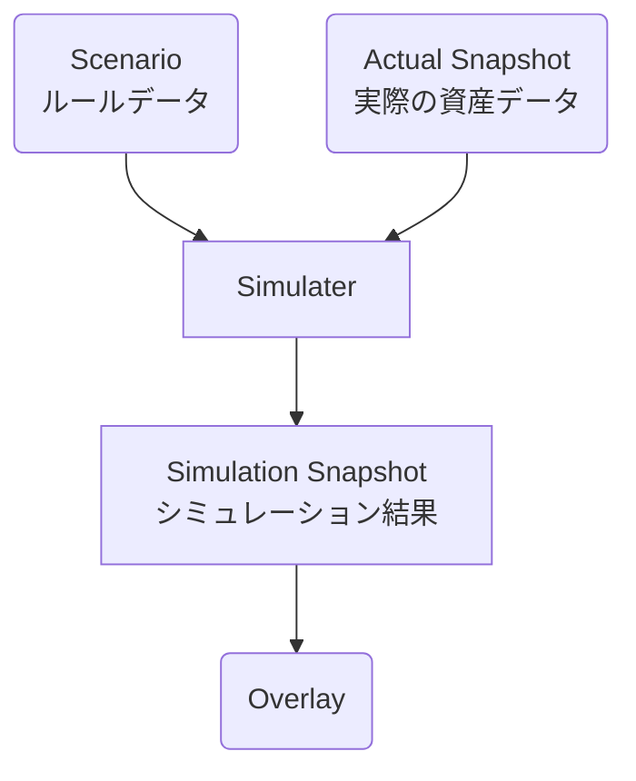
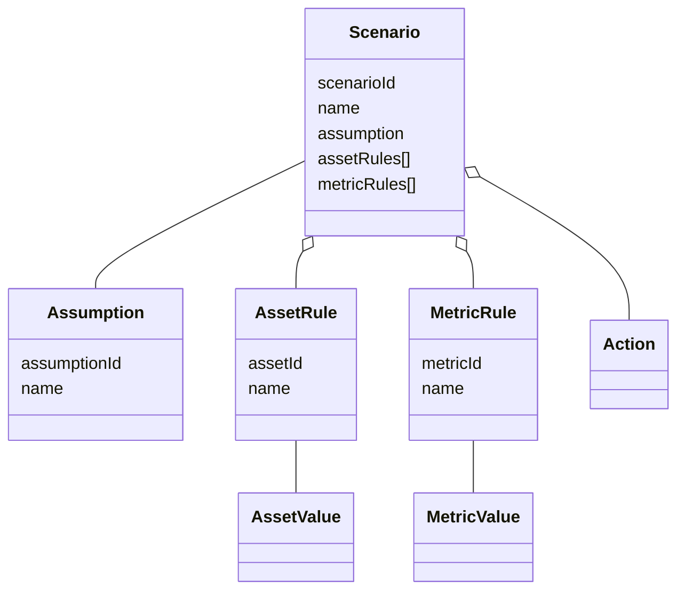
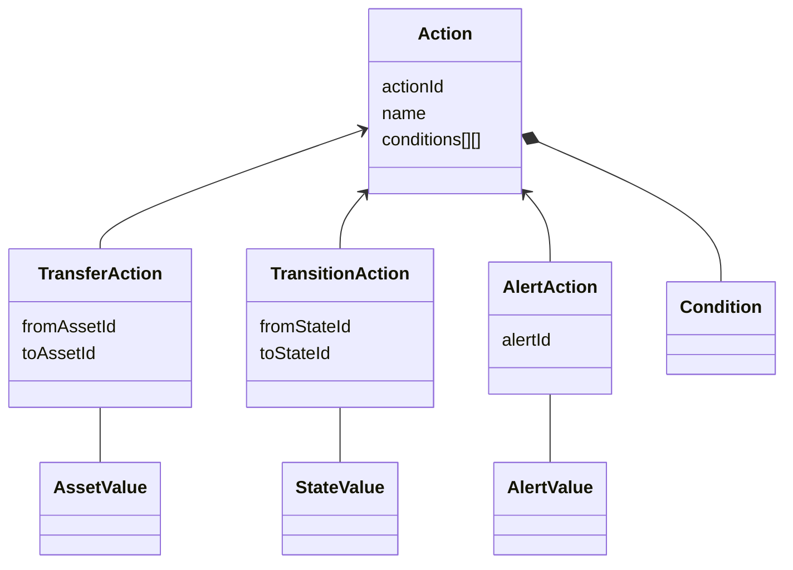
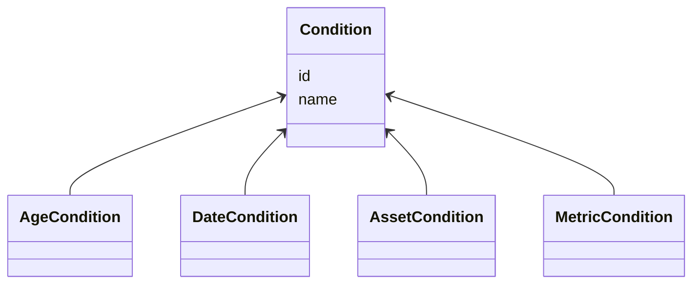
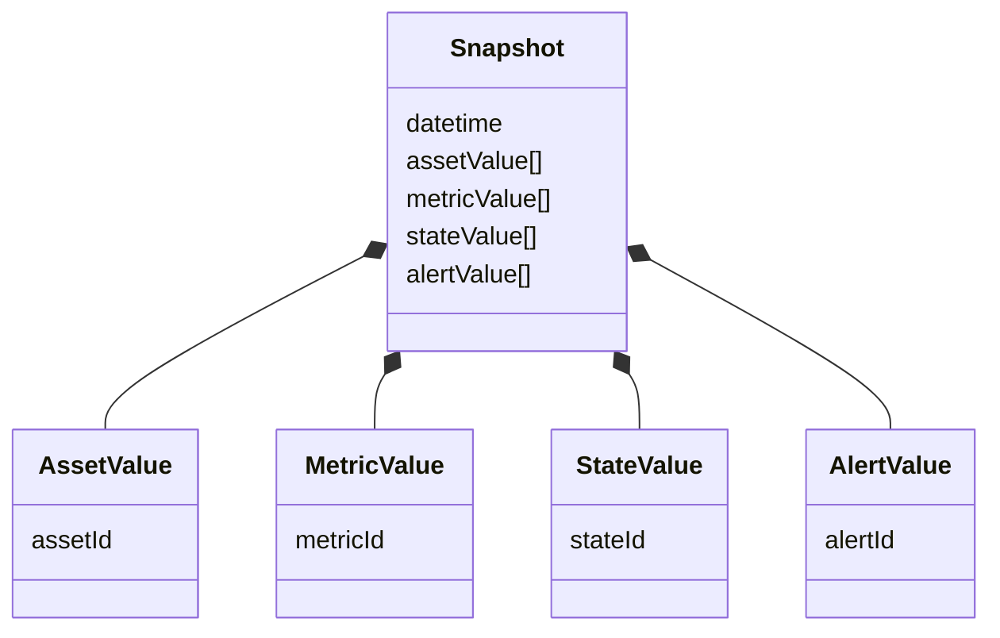
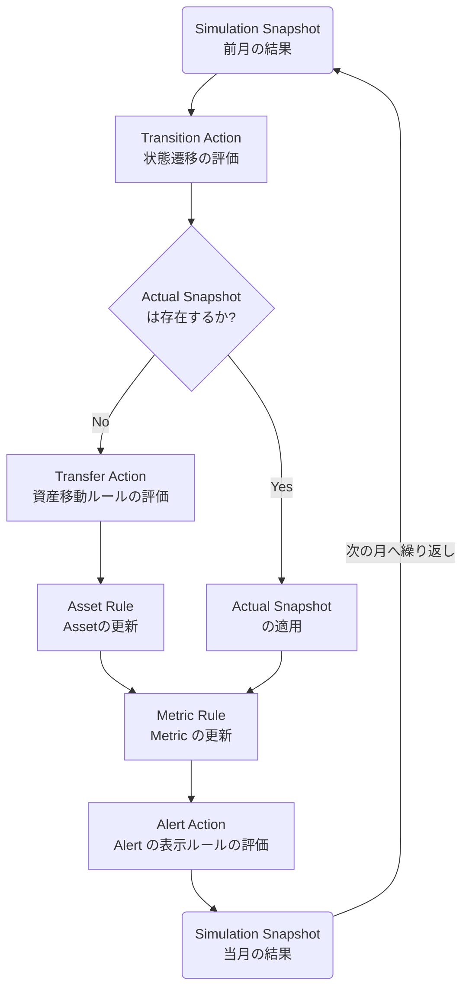

# Finances DSL

長期資産形成・退職計画を支援するシミュレーションアプリケーション

---

## 1. システム概要

Finances DSL は、長期資産形成・退職計画を支援するためのシミュレーションアプリケーションである

ユーザーは退職年齢、支出、運用利回り、インフレ率などの前提条件を変更しながら、複数の将来シナリオを同じグラフ上で比較できる。実績データを取り込むことで予測を最新の状態へ更新し、長期的な資産計画を継続的に見直せる。

このシステムで扱う中心概念は次の5つ。

| 用語      | 意味                                                       |
| ------------------ | --------------------------------------------------------- |
| Scenario           | 収入・支出・投資・退職などのルールを定義したデータ             |
| Actual Snapshot     | 実際の資産残高や取得価格などを記録した月単位の実績データ              |
| Simulater          | Scenario と Actual Snapshot から将来の資産推移を月単位で計算する処理 |
| Simulation Snapshot | Simulater から計算された月単位のデータ |
| Overlay            | 複数シナリオの Simulater Snapshot を同じグラフ上に重ねて比較する表示  |

---

## 2. アーキテクチャ

### 全体フロー

システムが永続化するデータは **Scenario** と **Actual Snapshot** のみ

**Actual Snapshot** と **Simulation Snapshot** は共に **Snapshot** 型で表現される

---

### Scenario

Scenario は将来の資産推移をシミュレーションするためのルールを定義する。

Scenario はシミュレーション開始前に確定し、シミュレーション中に変更されない Immutable なデータとして扱う。

Assumption, AssetRule, MetricRule, Action はユニークな ID を持つ

| 用語       | 意味                                 | 例                   |
| ---------- | ----------------------------------- | -------------------- |
| Assumption | Scenario の前提条件                  | 生年月日, インフレ率   |
| AssetRule  | Scenario で取り扱う資産の評価ルール   | 現金, 投資信託        |
| MetricRule | Metric の算出ルール                  | 総資産, 税引後流動資産 |
| Action     | 毎月のシミュレーション結果に対して評価・実行する振る舞い(後述) | - |

---

### Action

| 用語             | 意味                               | 例                |
| ---------------- | ----------------------------------- | ---------------- |
| TransferAction   | 毎月評価される資産移動アクション          | 給与, 投資積立     |
| TransitionAction | シミュレーション状態を変更するアクション   | 退職後, 年金受給   |
| AlertAction      | シミュレーション結果に対する判定アクション | 現金不足, FIRE達成 |
---

### Condition

| 用語            | 意味                 |
| --------------- | ------------------- |
| AgeCondition    | 年齢での判定条件      |
| DateCondition   | 期日での判定条件      |
| AssetCondition  | Asset 値での判定条件  |
| MetricCondition | Metric 値での判定条件 |

### Snapshot

Snapshot は、月のシミュレーション結果 (Simulation Snapshot) や実際の資産残高や取得価格などの Asset (Actual Snapshot) を記録する

---

### 月次処理

月々の Simulation Snapshot は以下フローに従い、再計算可能な導出データとして扱う。

