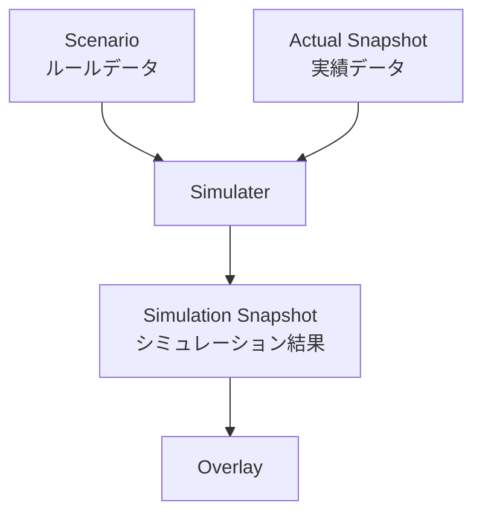
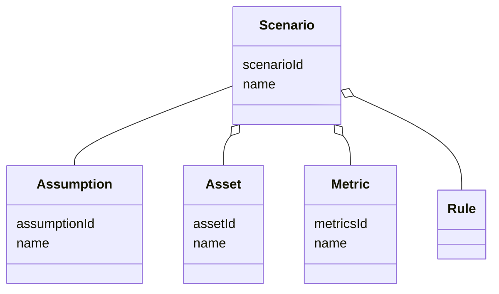
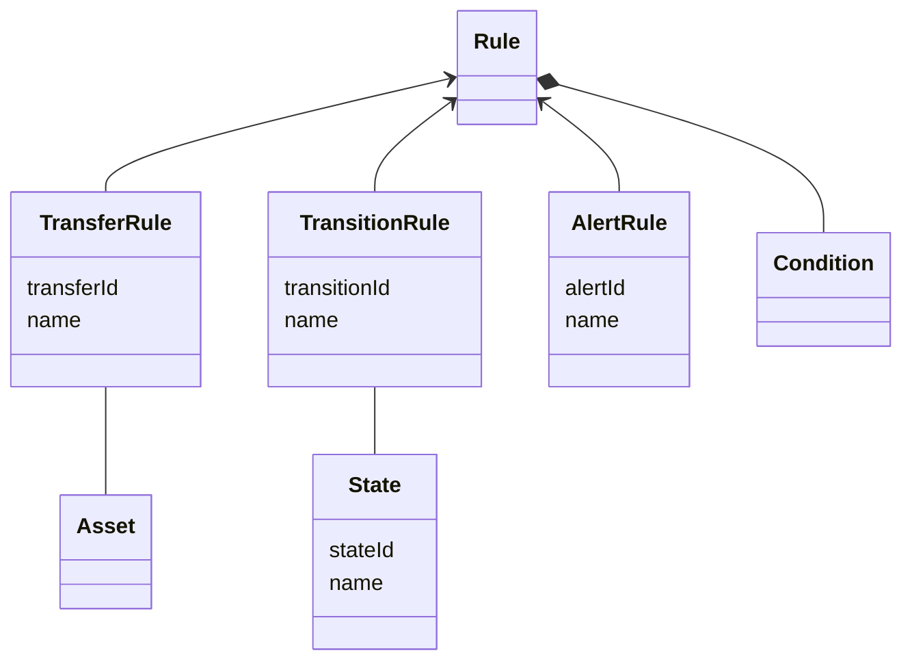
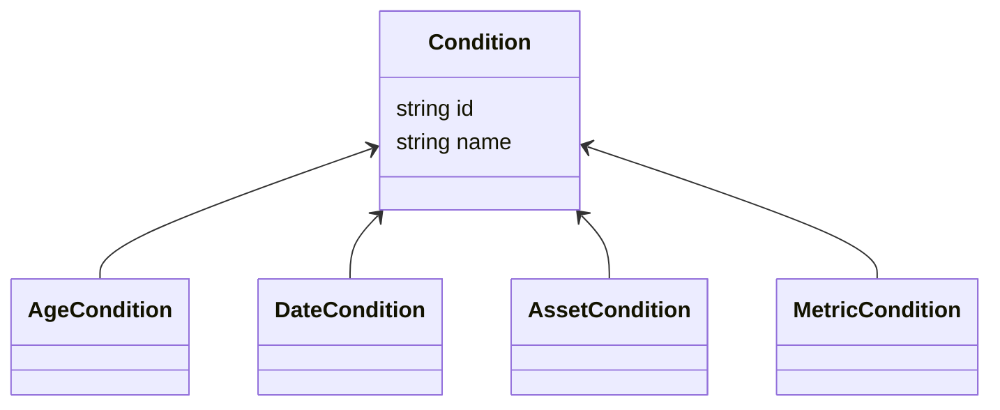
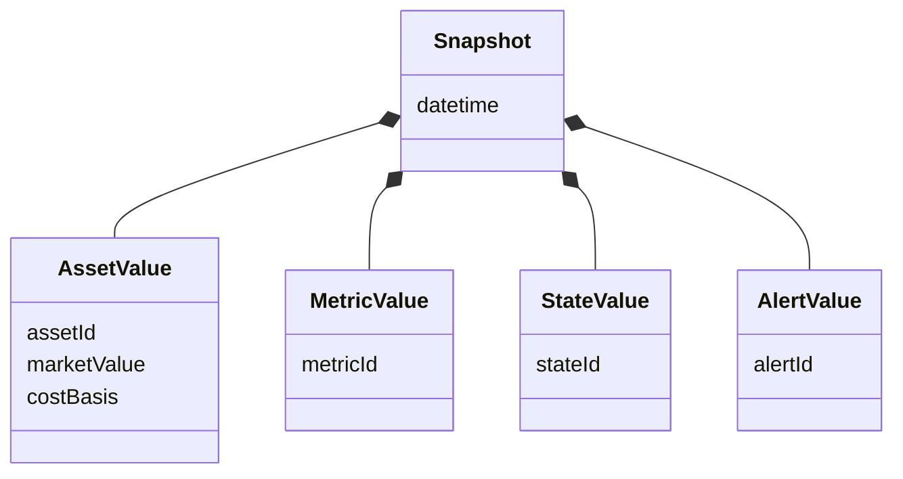
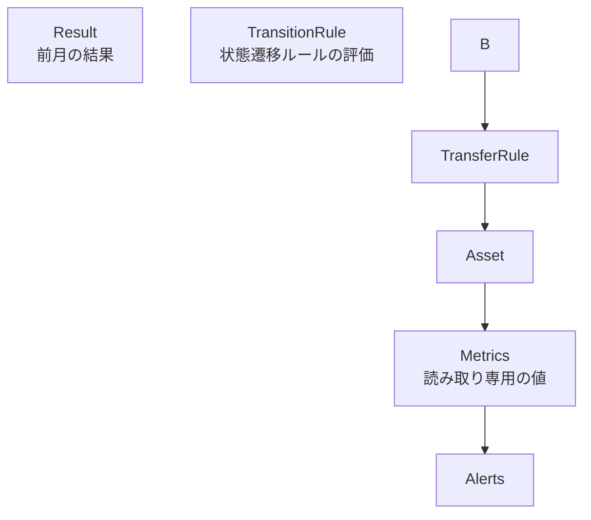
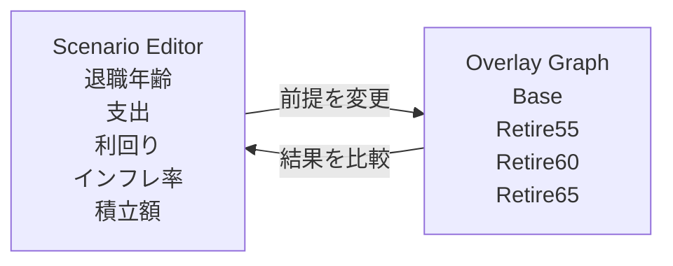

# Finances DSL

長期資産形成・退職計画を支援するシミュレーションアプリケーション

---

## 1. システム概要

Finances DSL は、長期資産形成・退職計画を支援するためのシミュレーションアプリケーションです。

ユーザーは退職年齢、支出、運用利回り、インフレ率などの前提条件を変更しながら、複数の将来シナリオを同じグラフ上で比較できます。実績データを取り込むことで予測を最新の状態へ更新し、長期的な資産計画を継続的に見直せます。

このシステムで扱う中心概念は次の4つです。

| 用語      | 意味                                                          |
| --------- | ------------------------------------------------------------- |
| Scenario  | 収入・支出・投資・退職などのルールを定義したデータ            |
| Snapshot  | 実際の資産残高や取得価格などを記録した実績データ              |
| Simulater | Scenario と Snapshot から将来の資産推移を月単位で計算する処理 |
| Overlay   | 複数シナリオの結果を同じグラフ上に重ねて比較する表示          |

---

## 2. アーキテクチャ

### 全体フロー

システムが永続化するデータは **Scenario** と **Actual Snapshot** のみです。

**Actual Snapshot** と **Simulation Snapshot** は共に **Snapshot** 型で表現されます。

---

### Scenario

Scenario は、将来の資産推移をシミュレーションするためのルールを定義する。

Scenario はシミュレーション開始前に確定し、シミュレーション中に変更されない Immutable データとして扱う。

| 用語       | 意味                                                         | 例                     |
| ---------- | ------------------------------------------------------------ | ---------------------- |
| Assumption | Scenario の前提条件                                          | 生年月日, インフレ率   |
| Asset      | Scenario で取り扱う資産データ                                | 現金, 投資信託         |
| Metric     | Assetを元にした資産データ                                    | 総資産, 税引後流動資産 |
| Rule       | 毎月のシミュレーション結果に対して評価・実行するルール(後述) | -                      |

---

### Rule

| 用語           | 意味                                                         | 例                     |
| -------------- | ------------------------------------------------------------ | ---------------------- |
| TransferRule   | Scenario の前提条件                                          | 生年月日, インフレ率   |
| TransitionRule | Scenario で取り扱う資産データ                                | 現金, 投資信託         |
| AlertRule      | Assetを元にした資産データ                                    | 総資産, 税引後流動資産 |
| State          | 毎月のシミュレーション結果に対して評価・実行するルール(後述) | -                      |

---

### Condition

| 用語           | 意味                                                         | 例                     |
| -------------- | ------------------------------------------------------------ | ---------------------- |
| TransferRule   | Scenario の前提条件                                          | 生年月日, インフレ率   |
| TransitionRule | Scenario で取り扱う資産データ                                | 現金, 投資信託         |
| AlertRule      | Assetを元にした資産データ                                    | 総資産, 税引後流動資産 |
| State          | 毎月のシミュレーション結果に対して評価・実行するルール(後述) | -                      |

### Snapshot

Snapshot は、月の実際の資産残高や取得価格などの実績値を記録する。

Simulation は Scenario に基づいて将来を予測するが、月々の Snapshot を反映することで、予測を実績値に合わせて補正できる。

| 用語       | 意味                | 例                   |
| ---------- | ------------------- | -------------------- |
| AssetValue | Scenario の前提条件 | 生年月日, インフレ率 |
| AssetValue | Scenario の前提条件 | 生年月日, インフレ率 |
| AssetValue | Scenario の前提条件 | 生年月日, インフレ率 |

---

### 月次処理

SimulationResult、Metrics、Alerts、GraphData などはすべて再計算可能な導出データとして扱います。これにより、保存対象を最小化し、同じ入力から同じ結果を再生成できる状態を保ちます。

月次シミュレーションは、大きく以下の流れで実行されます。

1. 実績反映
1. 状態変更
1. 入出金・積立・売却
1. 利回り反映
1. 指標計算
1. アラート判定
1. 翌月へ

---

## 3. 設計思想

Finances DSL は、次の3つの思想を重視します。

| 原則          | 内容                                                             |
| ------------- | ---------------------------------------------------------------- |
| Deterministic | 同じ Scenario と ActualObservation からは常に同じ結果を生成する  |
| Replayable    | 任意の月の状態を再現し、なぜその結果になったかを追跡できる       |
| Graph-centric | 数値一覧よりも、複数シナリオを重ねた時系列グラフを中心に比較する |

このシステムは、将来を確率的に当てることを目的にしません。モンテカルロシミュレーションや暴落確率モデルではなく、ユーザーが定義した前提条件に基づいて、説明可能な資産推移を生成します。

---

## 4. 利用イメージ

Finances DSL は、単なるダッシュボードではなく、**シナリオを編集しながら将来を探索するワークベンチ**として使います。

例えば、ユーザーは次のような比較を行えます。

- 55歳退職と60歳退職で、資産推移がどれだけ変わるか
- 利回りを低めに見積もった場合でも資産が持つか
- インフレ率を高めに設定した場合、現金がいつ不足するか
- 実績値を反映した後、以前の予測からどれだけ変化したか

このように、Finances DSL は「正解を自動で出す」ツールではなく、**複数の未来を見比べながら納得できる計画を作る**ためのツールです。
