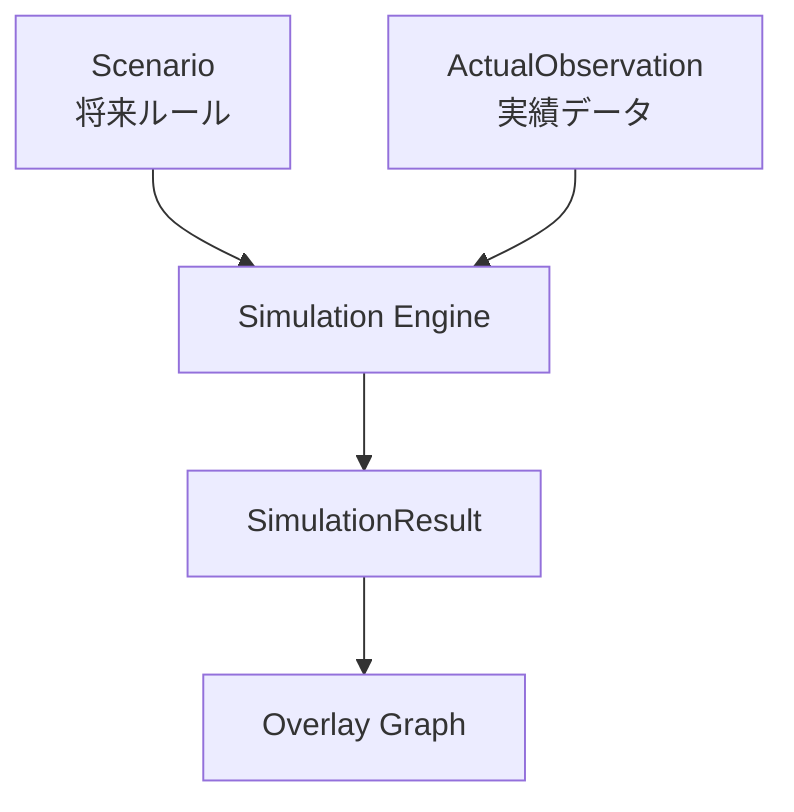
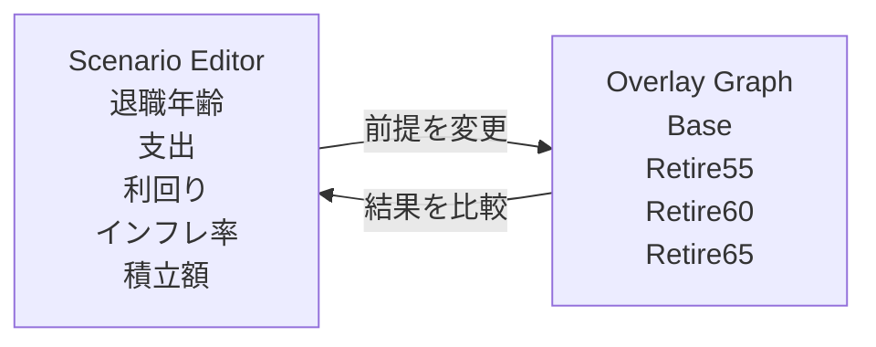

# Finances DSL

長期資産形成・退職計画を支援するシミュレーションエンジン

## 1. システム概要

Finances DSL は、長期資産形成・退職計画・FIRE を支援するためのシミュレーションエンジンです。

ユーザーは退職年齢、支出、運用利回り、インフレ率などの前提条件を変更しながら、複数の将来シナリオを同じグラフ上で比較できます。実績データを取り込むことで予測を最新の状態へ更新し、長期的な資産計画を継続的に見直せます。

このシステムで扱う中心概念は次の4つです。

| 用語                | 意味                                                |
| ----------------- | ------------------------------------------------- |
| Scenario          | 将来の収入・支出・投資・退職などのルールを定義した YAML                    |
| ActualObservation | 実際の資産残高や取得価格などを記録した実績データ                          |
| Simulation        | Scenario と ActualObservation から将来の資産推移を月単位で計算する処理 |
| Overlay Graph     | 複数シナリオの結果を同じグラフ上に重ねて比較する表示                        |

Finances DSL の最大の価値は、**グラフを見ながら前提条件を変更し、複数の未来を比較できること**です。

## 2. アーキテクチャ

システムが永続化するデータは **Scenario** と **ActualObservation** のみです。

SimulationResult、Metrics、Alerts、GraphData などはすべて再計算可能な導出データとして扱います。これにより、保存対象を最小化し、同じ入力から同じ結果を再生成できる状態を保ちます。

月次シミュレーションは、大きく以下の流れで実行されます。

1. 実績反映
1. 状態変更
1. 入出金・積立・売却
1. 利回り反映
1. 指標計算
1. アラート判定
1. 翌月へ

## 3. 設計思想

Finances DSL は、次の3つの思想を重視します。

| 原則            | 内容                                             |
| ------------- | ---------------------------------------------- |
| Deterministic | 同じ Scenario と ActualObservation からは常に同じ結果を生成する |
| Replayable    | 任意の月の状態を再現し、なぜその結果になったかを追跡できる                  |
| Graph-centric | 数値一覧よりも、複数シナリオを重ねた時系列グラフを中心に比較する               |

このシステムは、将来を確率的に当てることを目的にしません。モンテカルロシミュレーションや暴落確率モデルではなく、ユーザーが定義した前提条件に基づいて、説明可能な資産推移を生成します。

## 4. 利用イメージ

Finances DSL は、単なるダッシュボードではなく、**シナリオを編集しながら将来を探索するワークベンチ**として使います。

例えば、ユーザーは次のような比較を行えます。

* 55歳退職と60歳退職で、資産推移がどれだけ変わるか
* 利回りを低めに見積もった場合でも資産が持つか
* インフレ率を高めに設定した場合、現金がいつ不足するか
* 実績値を反映した後、以前の予測からどれだけ変化したか

このように、Finances DSL は「正解を自動で出す」ツールではなく、**複数の未来を見比べながら納得できる計画を作る**ためのツールです。
