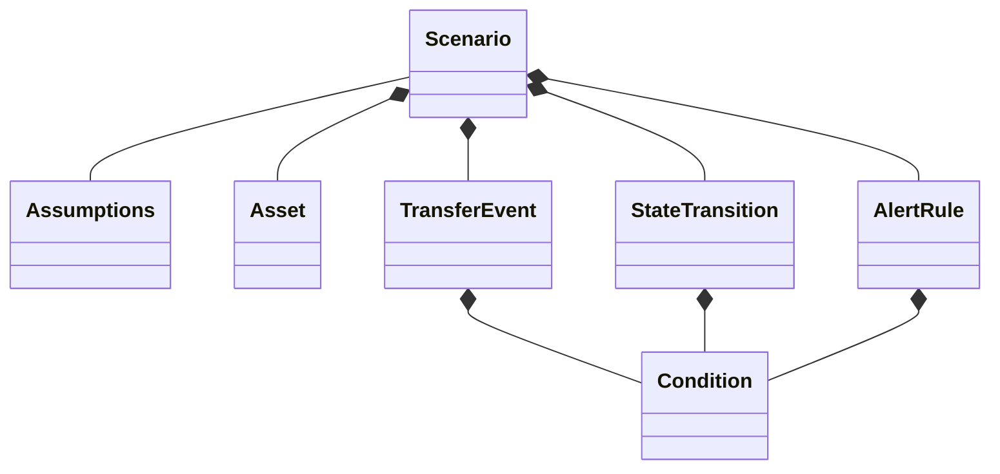

# Scenario Specification

## Structure

Scenario は以下の要素から構成される。



---

## Scenario

Scenario は、将来の資産推移をシミュレーションするためのルールを定義する。

Scenario はシミュレーション開始前に確定し、シミュレーション中に変更されない Immutable データとして扱う。

各 Scenatio は一意な `scenarioId` を持つ 

---

## Assumption

シミュレーション全体に一つだけ存在する前提条件であり全 Scenario の共通設定。

Asset 固有の性質や TransferEvent 固有の設定は置かない。

例

- 生年月日
- シミュレーション開始年月

---

## Asset

シミュレーション対象となる資産。

各 Asset は一意な `assetId` を持つ。

資産残高は TransferEvent と運用利回り `return_profile` によって変化する。

---

## TransferEvent

毎月評価される資産移動ルール。

例

- 給与
- 生活費
- 投資積立
- 資産取り崩し

TransferEvent は定義順に逐次適用される。

各TransferEvent は一意な `transferId` を持つ。

`condition` が成立したとき実行される。

---

## StateTransitions

シミュレーション状態を変更するルール。

例

- 退職後
- 年金受給

StateTransitions は定義順に逐次適用される。

各 StateTransitions は一意な `transitionId` を持つ。

`condition` が成立したとき実行される。

---

## AlertRule

SimulationResult に対する判定ルール。

例

- 現金不足
- FIRE達成
- 資産枯渇

AlertRule は定義順に逐次適用される。

各 AlertRule は一意な `alertId` を持つ。

`condition` が成立したとき実行される。

---

## Condition

例
- Metrics `積立NISA` が 6,000,000円 を超えるまで (Asset `保有現金` を Asset `NISA` に移行)
- 2030年3月の場合 (StateTransition で `退職後` に移行)
- Asset `銀行口座` が 0円を下回った場合 (Alere を実行) 


## Monthly Processing

Simulation は毎月以下の順序で実行される。

1. ActualObservation を反映
2. State Transition
3. Transfer Events
4. Investment Return
5. Metrics
6. Alert 判定

詳細は `execution-timeline.md` を参照する。

---

## Example

```yaml
assumptions:
  inflation_rate: 0.02

assets:
  - asset_id: cash
    market_value: 5000000

transfer_events:
  - id: salary
    from: external
    to: cash
    amount:
      type: fixed
      value: 400000
    schedule:
      type: monthly

state_transitions:
  - id: retired_at_60
    state: retired
    condition:
      age:
        gte: 60

alert_rules:
  - id: cash_shortage
    target:
      type: metric
      id: cash_total
    condition:
      value:
        target:
          type: metric
          id: cash_total
        operator: lte
        value: 0
    purpose: warning
```

---

## Design Principles

- Scenario は Source of Truth の一つである
- Scenario は Immutable である
- 同じ入力から同じ結果を生成する
- 詳細な計算方法は Simulation Engine が担う