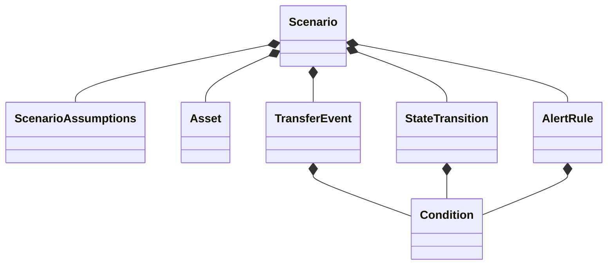
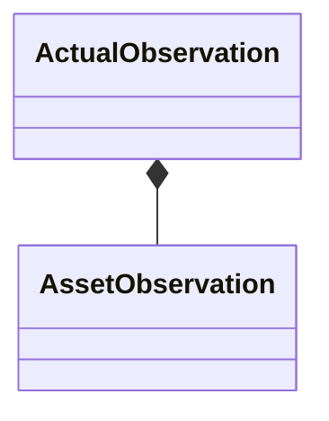

# Data Model Specification

## Purpose

Data Model は、Finances DSL を構成する主要なドメインモデルと、それぞれの責務を定義する。

詳細なフィールド定義は各 Specification を参照する。

---

## Model Overview





```text

ActualObservation
        │
        ▼

Simulation Engine
        │
        ▼

SimulationResult
        │
        ├── SimulationState (Month 1)
        ├── SimulationState (Month 2)
        ├── ...
        └── SimulationState (Month N)
```

---

## Scenario

将来のシミュレーションルールを定義する。

Scenario は Source of Truth の一つであり、Simulation 中に変更されない。

詳細は `scenario.md` を参照する。

---

## ActualObservation

実際の資産状況を記録する。

Simulation の開始時、および途中の補正に利用する。

ActualObservation は Source of Truth の一つである。

詳細は `actual-observation.md` を参照する。

---

## SimulationState

ある月の状態を表すスナップショット。

主に以下を保持する。

- 年月
- State
- Asset の現在値
- Metrics
- Alerts

SimulationState は毎月生成され、過去の状態を書き換えない。

---

## SimulationResult

Simulation 全体の結果。

SimulationState を時系列に保持する。

Graph や Query は SimulationResult を参照する。

SimulationResult は導出データであり、永続化しない。

---

## Relationships

```text
Scenario
        │
        ├──────────────┐
        │              │
        ▼              │
Simulation Engine      │
        ▲              │
        │              │
ActualObservation ─────┘
        │
        ▼
SimulationResult
        │
        ▼
SimulationState
```

---

## Persistence

永続化するモデルは以下のみ。

- Scenario
- ActualObservation

以下は導出データとする。

- SimulationResult
- SimulationState
- Metrics
- Alerts

---

## Design Principles

- Source of Truth を最小化する
- Immutable なデータモデルとする
- SimulationResult は常に再生成可能とする
- ドメインモデル間の責務を明確に分離する